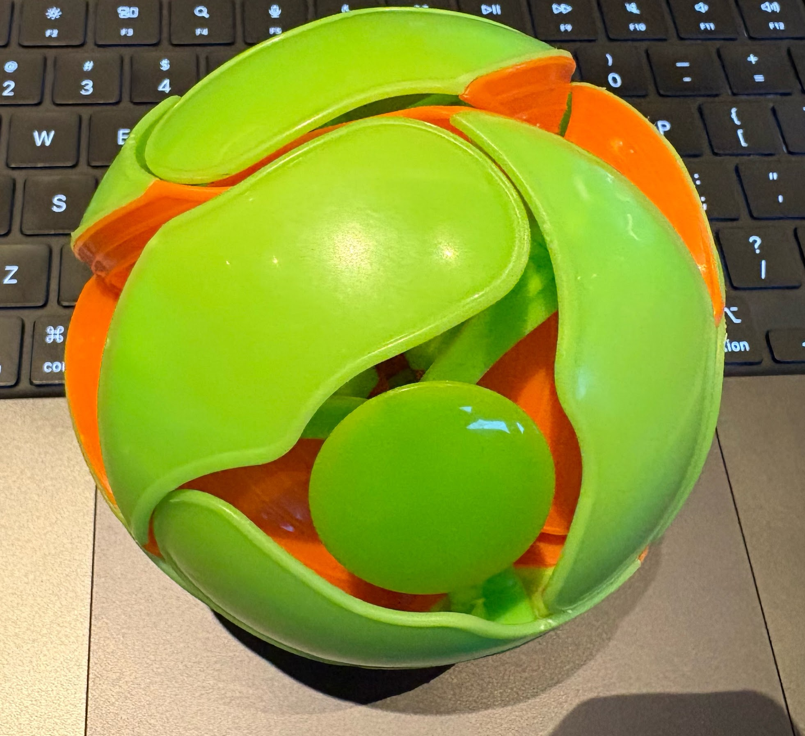

# Freeze



[English](README.md)

> [!IMPORTANT]
> **🎯 100スター目標**
>
> このリポジトリのスターが100を超えたら、iOS/Androidウィジェットを開発予定！ホーム画面でストリーク状況やフリーズチケット残数をいつでも確認できるようになります。
>
> 興味がある方はぜひ ⭐ をお願いします！

Always Green サービスのフリーズ用リポジトリです。

## このリポジトリについて

フリーズチケットを使用した際に、GitHubのコントリビューション（草）を記録するためのリポジトリです。

Always Green では、7日間連続でコードを書くと「フリーズチケット」が獲得できます。忙しい日や体調が悪い日にフリーズチケットを使うと、このリポジトリにコミットが作成され、ストリーク（連続記録）を守ることができます。

## 仕組み

1. ユーザーが Always Green でフリーズチケットを使用
2. このリポジトリに日付別のログファイルが作成される
3. コミットによりGitHubのコントリビューションが記録される
4. ストリークが維持される

## ログ構造

フリーズの使用履歴は以下の形式で保存されます。

```
logs/
└── YYYY/
    └── MM/
        └── DD/
            └── freeze.md
```

各ファイルには、その日にフリーズを使用したユーザー名が記録されます。

## 関連リンク

- [Always Green](https://always-green.org/) - メインサービス
- [Always Blue (Silicon Valley)](https://www.youtube.com/watch?v=ElJe5M54brI) - 名前の由来
